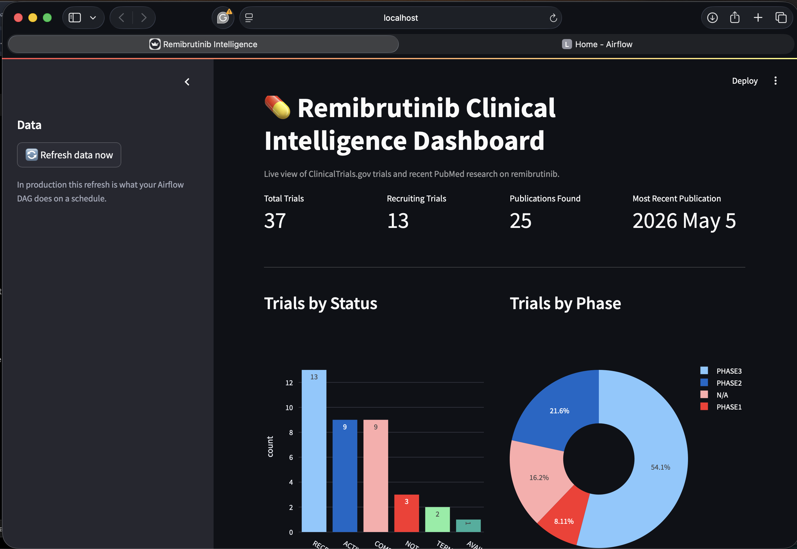
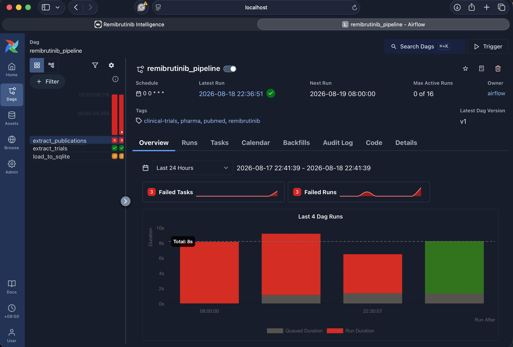
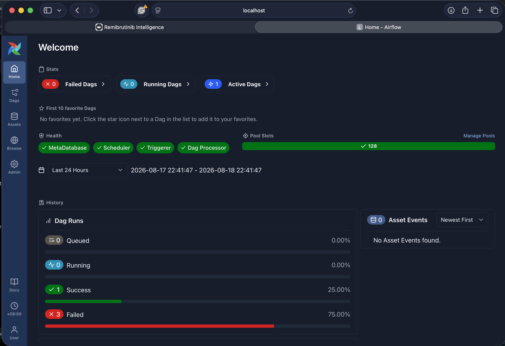

# 💊 Pharma Clinical Intelligence Dashboard

An end-to-end data engineering and analytics project for collecting, processing, and visualizing **remibrutinib clinical trial and research publication data**.

The project uses **ClinicalTrials.gov**, **PubMed**, **SQLite**, **Apache Airflow**, and **Streamlit** to create an automated clinical intelligence pipeline.

---

## 📸 Dashboard Screenshots

### 1. Dashboard Overview



---

### 2. Apache Airflow



---

### 3. Apache AirFlow Dashboard



---

# 📌 Project Overview

This project collects information about **remibrutinib** from two sources:

* **ClinicalTrials.gov** — clinical trial information
* **PubMed** — recent research publications

The collected data is stored in a local **SQLite database** and displayed through an interactive **Streamlit dashboard**.

Apache Airflow is used to automate the data pipeline on a daily schedule.

---

# 🏗️ Project Architecture

```text
ClinicalTrials.gov API
        │
        ▼
┌───────────────────┐
│                   │
│    pipeline.py    │
│                   │
│ Extract            │
│ Transform          │
│ Load               │
│                   │
└─────────┬─────────┘
          │
          ▼
   ┌──────────────┐
   │              │
   │ SQLite DB    │
   │              │
   │ pharma.db    │
   │              │
   └───────┬──────┘
           │
           ├──────────────────┐
           │                  │
           ▼                  ▼
   ┌───────────────┐   ┌───────────────┐
   │   Airflow     │   │   Streamlit   │
   │      DAG      │   │   Dashboard   │
   └───────────────┘   └───────────────┘
                              │
                              ▼
                     Clinical Intelligence
                          Dashboard
```

---

# ✨ Features

## 1. Clinical Trial Data

The pipeline searches ClinicalTrials.gov for clinical trials related to remibrutinib.

The following information is collected:

* Trial ID
* Trial title
* Trial status
* Trial phase
* Conditions
* Sponsor
* Start date

---

## 2. PubMed Research Data

The pipeline searches PubMed for recent publications mentioning remibrutinib.

The following information is collected:

* PubMed ID
* Publication title
* Journal
* Publication date

Publications are sorted by publication date so the latest research can be displayed first.

---

## 3. SQLite Database

The extracted data is stored in:

```text
data/pharma.db
```

The database contains two main tables:

```text
clinical_trials
publications
```

---

## 4. Apache Airflow

Apache Airflow is used to orchestrate the data pipeline.

The DAG is:

```text
remibrutinib_pipeline
```

The pipeline is scheduled to run daily.

The workflow consists of three main tasks:

```text
Extract Clinical Trials
          │
          ├──────────────┐
          │              │
          ▼              ▼
Extract PubMed       Clinical Trial Data
          │              │
          └──────┬───────┘
                 ▼
          Load Data to SQLite
```

---

## 5. Streamlit Dashboard

The Streamlit application provides an interactive dashboard containing:

* Total number of clinical trials
* Number of recruiting trials
* Number of publications
* Most recent publication
* Trials by status
* Trials by phase
* Complete clinical trial table
* Latest research findings
* Manual data refresh

The dashboard can manually refresh the data using the **Refresh data now** button.

---

# 📁 Project Structure

```text
remibrutinib/
│
├── app.py
├── pipeline.py
├── remibrutinib_dag.py
├── README.md
├── requirements.txt
├── .gitignore
│
├── image1.png
├── image2.png
├── image3.png
│
└── data/
    └── pharma.db
```

---

# 🛠️ Technologies Used

| Technology                | Purpose                   |
| ------------------------- | ------------------------- |
| Python                    | Main programming language |
| Pandas                    | Data processing           |
| Requests                  | API requests              |
| SQLite                    | Data storage              |
| Apache Airflow            | Pipeline orchestration    |
| Streamlit                 | Dashboard                 |
| Plotly                    | Data visualization        |
| ClinicalTrials.gov API    | Clinical trial data       |
| PubMed / NCBI E-utilities | Research publication data |

---

# 🚀 Getting Started

## Step 1 — Clone the Repository

Clone the GitHub repository to your computer:

```bash
git clone https://github.com/YOUR_USERNAME/remibrutinib-clinical-intelligence.git
```

Move into the project directory:

```bash
cd remibrutinib-clinical-intelligence
```

---

## Step 2 — Create a Virtual Environment

Create a Python virtual environment:

```bash
python -m venv .venv
```

### macOS / Linux

Activate the environment:

```bash
source .venv/bin/activate
```

### Windows

Activate the environment:

```bash
.venv\Scripts\activate
```

---

## Step 3 — Install Dependencies

Install the required Python packages:

```bash
pip install -r requirements.txt
```

---

# 🔄 Running the Data Pipeline

## Step 4 — Run `pipeline.py`

Run the data pipeline:

```bash
python pipeline.py
```

The pipeline will:

1. Search ClinicalTrials.gov for remibrutinib trials.
2. Retrieve clinical trial information.
3. Search PubMed for remibrutinib publications.
4. Retrieve publication information.
5. Store the data in SQLite.
6. Save the database to:

```text
data/pharma.db
```

---

# 📊 Running the Streamlit Dashboard

## Step 5 — Start Streamlit

Run:

```bash
streamlit run app.py
```

Streamlit will start the dashboard locally.

Open the URL provided in the terminal, usually:

```text
http://localhost:8501
```

The dashboard will display the clinical trial and publication data stored in the SQLite database.

---

# 🔄 Refreshing Data

There are two ways to refresh the data.

### Option 1 — Run the pipeline manually

```bash
python pipeline.py
```

### Option 2 — Use the Dashboard

Open the Streamlit dashboard and click:

```text
🔄 Refresh data now
```

The dashboard will run the data pipeline and reload the latest information.

---

# ⏰ Running the Pipeline with Airflow

## Step 6 — Configure Apache Airflow

The Airflow DAG is located in:

```text
remibrutinib_dag.py
```

The DAG ID is:

```text
remibrutinib_pipeline
```

The schedule is:

```text
@daily
```

The DAG contains three tasks:

```text
1. Extract Clinical Trials
2. Extract PubMed Publications
3. Load Data to SQLite
```

---

## Step 7 — Start Airflow

After installing and configuring Apache Airflow, place the DAG file into your Airflow DAGs directory.

For example:

```text
~/airflow/dags/remibrutinib_dag.py
```

Start the Airflow services according to your Airflow environment.

Then open the Airflow UI and find:

```text
remibrutinib_pipeline
```

Enable the DAG to allow it to run on its daily schedule.

---

# 🔍 Data Flow

## ClinicalTrials.gov

```text
ClinicalTrials.gov
        │
        ▼
Search for "remibrutinib"
        │
        ▼
Retrieve Clinical Trials
        │
        ▼
Process with Pandas
        │
        ▼
Save to SQLite
        │
        ▼
Streamlit Dashboard
```

## PubMed

```text
PubMed
   │
   ▼
Search for "remibrutinib"
   │
   ▼
Retrieve Publication IDs
   │
   ▼
Retrieve Publication Summaries
   │
   ▼
Sort by Publication Date
   │
   ▼
Save to SQLite
   │
   ▼
Streamlit Dashboard
```

---

# 🧩 Main Components

## `pipeline.py`

Contains the main data extraction and loading logic.

The pipeline provides functions for:

```python
get_trials()
```

Retrieves clinical trial information from ClinicalTrials.gov.

```python
get_pubmed()
```

Retrieves recent PubMed publications.

```python
save_data()
```

Runs the extraction processes and saves the results to SQLite.

---

## `remibrutinib_dag.py`

Contains the Apache Airflow DAG.

The DAG calls the functions from `pipeline.py` and organizes them into Airflow tasks.

This separates the actual data processing logic from the scheduling and orchestration layer.

---

## `app.py`

Contains the Streamlit dashboard.

The dashboard reads data from:

```text
data/pharma.db
```

and displays:

* Clinical trial metrics
* Trial status charts
* Trial phase charts
* Clinical trial records
* Recent publications

---

# 🎯 Project Goals

The main goals of this project are to demonstrate:

* API data extraction
* ETL pipeline development
* Data processing with Pandas
* SQLite database management
* Workflow orchestration with Apache Airflow
* Interactive data visualization
* Streamlit dashboard development
* Separation of data pipeline and presentation layers

---

# 🔮 Future Improvements

Potential future improvements include:

* Add automated data quality checks
* Add unit tests
* Add pipeline logging
* Add GitHub Actions CI/CD
* Add Docker support
* Add more pharmaceutical data sources
* Track historical changes in clinical trials
* Add additional dashboard visualizations
* Deploy the Streamlit dashboard
* Add Airflow monitoring and alerts
* Improve database design for historical data


This project is for educational and demonstration purposes.
